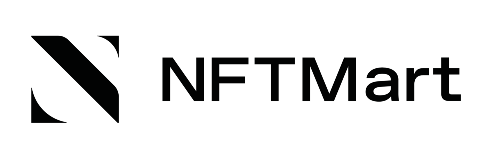

[](https://github.com/NFTT-studio/NFTMart-Node/actions/workflows/build.yml)
[](https://github.com/nftt-studio/nftmart-node/blob/master/LICENSE)
[](https://hub.docker.com/r/nftmart/node)

# NFTMart Node



## Networks

This repository contains code for NFTMart Mainnet, Staging and Dev network. These networks share the same nftmart-node binary. You can switch between different networks by specifying the correct chain spec when starting your node.

### Mainnet

You can connect to NFTMart Mainnet using the following public addresses

- `wss://mainnet.nftmart.io/rpc/ws`
- `https://mainnet.nftmart.io/rpc/http`

Or you can start a node locally and sync with the Mainnet

```
docker-compose up mainnet

# If you prefer using your own binary, try this instead
./target/release/nftmart-node --chain=/specs/mainnetRaw.json
```

### Staging Network

You can connect to NFTMart Staging Network using the following public addresses

- `wss://staging.nftmart.io/rpc/ws`
- `https://staging.nftmart.io/rpc/http`

Alternatively, you can start a node locally and sync with the Staging Network

```
docker-compose up staging

# If you prefer using your own binary, try this instead
./target/release/nftmart-node --chain=/specs/stagingRaw.json
```

### Dev Network

To start a Dev Network, you must run your own node:

```
docker-compose up dev

# If you prefer using your own binary, try this instead
./target/release/nftmart-node --dev --alice
```

then connect to it from the following rpc endpoints:

- `ws://127.0.0.1:9944`
- `http://127.0.0.1:9933`

## Build From Source

### Prepare Toolchain
Please follow this [link](https://substrate.dev/docs/en/knowledgebase/getting-started/) to prepare an development environment.

Remember to set your nightly toolchain version to `nightly-2021-09-01`, later versions may fail to compile.
```
NIGHTLY=nightly-2021-09-01
rustup install $NIGHTLY
rustup target add wasm32-unknown-unknown --toolchain $NIGHTLY
rustup default $NIGHTLY
```

### Compile And Run

```
cargo build --release -p nftmart-node

./target/release/nftmart-node --dev --alice --rpc-cors=all --rpc-methods=Unsafe --unsafe-ws-external
```

## Use Node.js to access nftmart blockchain

```shell
git clone https://github.com/NFTT-studio/nftmart-node
cd nftmart-node/nodejs-demo
yarn install

# Create a class(ID: 0) by Alice with local testing node.
node nft-apis.mjs --ws ws://127.0.0.1:9944 create-class //Alice

# Add a new class administrator to the class, ID: 0
node nft-apis.mjs --ws ws://127.0.0.1:9944 add-class-admin //Bob

# Create an another class(ID: 1) managed by Alice.
node nft-apis.mjs --ws ws://127.0.0.1:9944 create-class //Alice

# List all classes
node nft-apis.mjs --ws ws://127.0.0.1:9944 show-class-info
[
  '{"metadata":"https://xx.com/aa.jpg","totalIssuance":0,"owner":"62qUEaQwPx7g4vDz88bdp1tmZkSpPtVRL4pS98P7VEbZnM9w","data":{"deposit":2280000000000,"properties":3,"name":"0x616161","description":"0x62626262","createBlock":489},"classID":1,"adminList":[[{"delegate":"65ADzWZUAKXQGZVhQ7ebqRdqEzMEftKytB8a7rknW82EASXB","proxyType":"Any","delay":0}],261000000000000]}',
  '{"metadata":"https://xx.com/aa.jpg","totalIssuance":0,"owner":"62qUEaQwPx7g4vDz88bN4zMBTFmcwLPYbPsvbBhH2QiqWhfB","data":{"deposit":2280000000000,"properties":3,"name":"0x616161","description":"0x62626262","createBlock":8},"classID":0,"adminList":[[{"delegate":"63b4iSPL2bXW7Z1ByBgf65is99LMDLvePLzF4Vd7S96zPYnw","proxyType":"Any","delay":0},{"delegate":"65ADzWZUAKXQGZVhQ7ebqRdqEzMEftKytB8a7rknW82EASXB","proxyType":"Any","delay":0}],459000000000000]}'
]

# Mint three nft tokens to Bob in the class which ID is 0.
node nft-apis.mjs --ws ws://127.0.0.1:9944 mint-nft //Bob 0

# List all nfts in the class, `ID:0`
node nft-apis.mjs --ws ws://127.0.0.1:9944 show-all-nfts 0
{"metadata":"0x6161626263636464","owner":"63b4iSPL2bXW7Z1ByBgf65is99LMDLvePLzF4Vd7S96zPYnw","data":{"deposit":1080000000000,"createBlock":554}}
{"metadata":"0x6161626263636464","owner":"63b4iSPL2bXW7Z1ByBgf65is99LMDLvePLzF4Vd7S96zPYnw","data":{"deposit":1080000000000,"createBlock":554}}
{"metadata":"0x6161626263636464","owner":"63b4iSPL2bXW7Z1ByBgf65is99LMDLvePLzF4Vd7S96zPYnw","data":{"deposit":1080000000000,"createBlock":554}}

```
