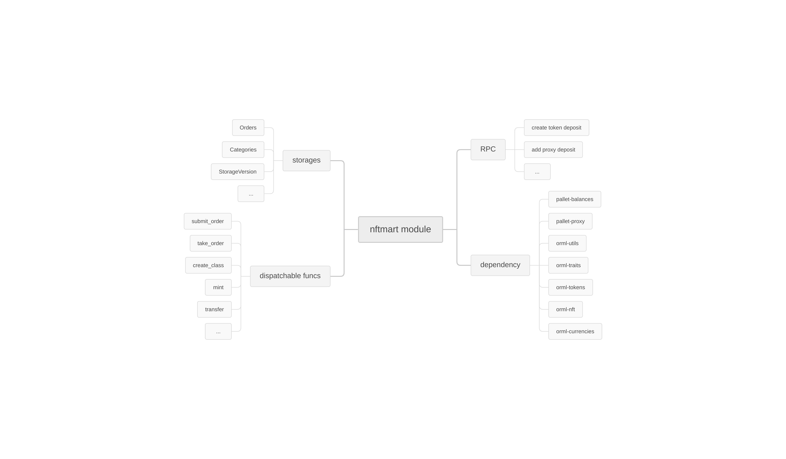

# NFTMART

[English Version](./README.md)

## 整体架构


## 安装

### 环境搭建
参考文档 [Getting Started](https://substrate.dev/docs/en/knowledgebase/getting-started/) 搭建开发环境.

### 在本地构建节点二进制并运行

```shell
git clone https://github.com/NFTT-studio/nftmart-node
cd nftmart-node
cargo build --release --bin substrate
target/release/substrate -d target/dev -lruntime=debug \
  --max-runtime-instances=30 \
  --execution=NativeElseWasm \
  --rpc-cors=all \
  --rpc-methods=Unsafe \
  --unsafe-ws-external \
  --dev \
  --port 30333 \
  --ws-port 9944 \
  --rpc-port 9933 \
  --ws-max-connections=10000
```

### 打包 Docker 镜像并启动多节点网络

```shell

# To build a docker image.
git clone https://github.com/NFTT-studio/nftmart-node
cd nftmart-node
NFTMARTROOT=`pwd`
cargo build --release --bin substrate
cd $NFTMARTROOT/target/release
tee Dockerfile <<-'EOF'
FROM ubuntu:20.04
WORKDIR /data
ADD substrate /usr/bin/substrate
EXPOSE 9944/tcp
EXPOSE 30333/tcp
EOF
docker build -t nftmart -f Dockerfile ./
cd $NFTMARTROOT

# Run nftmart with two validators
mkdir -p $NFTMARTROOT/target/release/dev-node0
mkdir -p $NFTMARTROOT/target/release/dev-node1
docker network create --subnet=172.28.0.0/16 --driver bridge chain-dev-net

docker run -d --restart unless-stopped --name dev-node0 \
 --mount type=bind,source=$NFTMARTROOT/target/release/dev-node0,destination=/data \
 --publish 9944:9944 \
 --network chain-dev-net \
 --hostname dev-node0 \
 --ip 172.28.0.2 \
 --entrypoint substrate \
 nftmart \
 -d /data \
 -lruntime=debug \
 --node-key 0000000000000000000000000000000000000000000000000000000000000001 \
 --execution=NativeElseWasm \
 --rpc-cors=all \
 --rpc-methods=Unsafe \
 --unsafe-ws-external \
 --chain local \
 --alice \
 --validator \
 --wasm-execution Interpreted \
 --ws-max-connections=10000

docker run -d --restart unless-stopped --name dev-node1 \
 --mount type=bind,source=$NFTMARTROOT/target/release/dev-node1,destination=/data \
 --network chain-dev-net \
 --hostname dev-node1 \
 --ip 172.28.0.3 \
 --entrypoint substrate \
 nftmart \
 -d /data \
 -lruntime=debug \
 --node-key 0000000000000000000000000000000000000000000000000000000000000002 \
 --execution=NativeElseWasm \
 --rpc-cors=all \
 --rpc-methods=Unsafe \
 --unsafe-ws-external \
 --chain local \
 --bob \
 --validator \
 --wasm-execution Interpreted \
 --bootnodes /dns/dev-node0/tcp/30333/p2p/12D3KooWEyoppNCUx8Yx66oV9fJnriXwCcXwDDUA2kj6vnc6iDEp \
 --ws-max-connections=10000
```


## 在本地启动前端 nftmart-fontend
```
docker run -d --restart unless-stopped \
	--publish 18001:5000 \
	--name nftmart-fontend \
	-e REACT_APP_WS_URL=ws://127.0.0.1:9944 \
	maomaotp/nftmart-fontend:040201 sh /start.sh
```

## 在本地运行区块浏览器 polkadot-js-apps
```
docker run -d  \
	--name polkadot-ui  \
	-e WS_URL=ws://127.0.0.1:9944  \
	-p 18002:80  \
	jacogr/polkadot-js-apps
```


## 用 Node.js 脚本提交链上交易 / 查询链上状态

```shell
git clone https://github.com/NFTT-studio/nftmart-node
cd nftmart-node/nodejs-demo
yarn install

# Create a class(ID: 0) by Alice with local testing node.
node nft-apis.mjs --ws ws://127.0.0.1:9944 create-class //Alice

# Add a new class administrator to the class, ID: 0
node nft-apis.mjs --ws ws://127.0.0.1:9944 add-class-admin //Bob

# Create an another class(ID: 1) managed by Alice.
node nft-apis.mjs --ws ws://127.0.0.1:9944 create-class //Alice

# List all classes
node nft-apis.mjs --ws ws://127.0.0.1:9944 show-class-info
[
  '{"metadata":"https://xx.com/aa.jpg","totalIssuance":0,"owner":"62qUEaQwPx7g4vDz88bdp1tmZkSpPtVRL4pS98P7VEbZnM9w","data":{"deposit":2280000000000,"properties":3,"name":"0x616161","description":"0x62626262","createBlock":489},"classID":1,"adminList":[[{"delegate":"65ADzWZUAKXQGZVhQ7ebqRdqEzMEftKytB8a7rknW82EASXB","proxyType":"Any","delay":0}],261000000000000]}',
  '{"metadata":"https://xx.com/aa.jpg","totalIssuance":0,"owner":"62qUEaQwPx7g4vDz88bN4zMBTFmcwLPYbPsvbBhH2QiqWhfB","data":{"deposit":2280000000000,"properties":3,"name":"0x616161","description":"0x62626262","createBlock":8},"classID":0,"adminList":[[{"delegate":"63b4iSPL2bXW7Z1ByBgf65is99LMDLvePLzF4Vd7S96zPYnw","proxyType":"Any","delay":0},{"delegate":"65ADzWZUAKXQGZVhQ7ebqRdqEzMEftKytB8a7rknW82EASXB","proxyType":"Any","delay":0}],459000000000000]}'
]

# Mint three nft tokens to Bob in the class which ID is 0.
node nft-apis.mjs --ws ws://127.0.0.1:9944 mint-nft //Bob 0

# List all nfts in the class, `ID:0`
node nft-apis.mjs --ws ws://127.0.0.1:9944 show-all-nfts 0
{"metadata":"0x6161626263636464","owner":"63b4iSPL2bXW7Z1ByBgf65is99LMDLvePLzF4Vd7S96zPYnw","data":{"deposit":1080000000000,"createBlock":554}}
{"metadata":"0x6161626263636464","owner":"63b4iSPL2bXW7Z1ByBgf65is99LMDLvePLzF4Vd7S96zPYnw","data":{"deposit":1080000000000,"createBlock":554}}
{"metadata":"0x6161626263636464","owner":"63b4iSPL2bXW7Z1ByBgf65is99LMDLvePLzF4Vd7S96zPYnw","data":{"deposit":1080000000000,"createBlock":554}}

```
